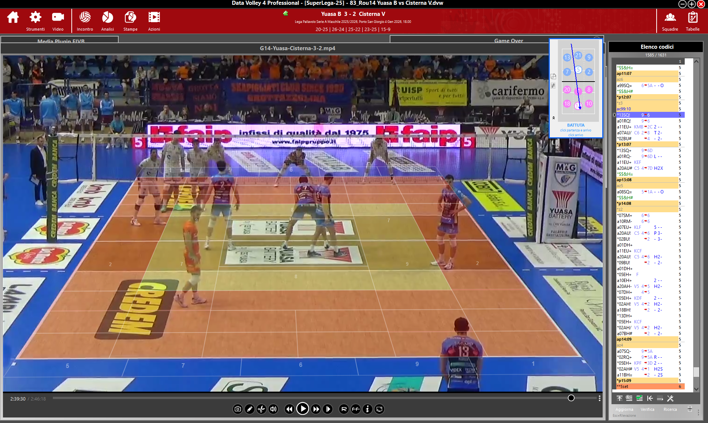

# ZoneMap Suite

Advanced tactical overlay for volleyball video analysis, designed to
support scouts and analysts while using Data Volley or any video player.

------------------------------------------------------------------------

## 🎯 Overview

ZoneMap Suite is a tactical overlay system that improves court zone
interpretation during volleyball video analysis.

Camera perspective often distorts spatial perception, making geometric
and tactical consistency difficult during scouting.\
ZoneMap solves this by providing a perspective-correct overlay aligned
to the court in real time.

------------------------------------------------------------------------

  

------------------------------------------------------------------------

## 📊 Use Case

ZoneMap can be used for:

-   Reception pattern analysis\
-   Defensive gap visualization\
-   Setter distribution analysis\
-   Conflict zone tracking\
-   Tactical area highlighting

Designed for real operational use during match preparation and live
analysis.

------------------------------------------------------------------------

## 🚀 Features

### V1 -- Perspective Overlay

-   Deformable 3x3 grid
-   Homography-based perspective correction
-   Always-on-top overlay
-   Click-through mode

### V2 -- ZoneMap Suite

-   Custom 2D Tactical Editor
-   Real-time perspective projection
-   Multi-language support (IT / EN)
-   JSON configuration persistence
-   DPI optimization for high-resolution displays
-   Integrated feedback system
-   F8 / F9 quick visibility shortcuts

------------------------------------------------------------------------

## 🛠 Technical Architecture

-   Homography matrix transformations (numpy)
-   GUI built with PySide6 (Qt for Python)
-   Windows system integration via pywin32
-   JSON-based configuration storage (AppData)
-   Modular Work Package (WP) structure
-   Structured documentation for each development block

------------------------------------------------------------------------

## 🧠 Development Approach

This project applies structured methodology to rapid development:

-   Triple Constraint (Time, Cost, Quality)
-   WBS-based micro Work Packages
-   Markdown documentation for each WP
-   AI used as a development accelerator
-   Iterative refinement based on real-world usage

First usable version built in less than one working day.

------------------------------------------------------------------------

## 📥 Installation

1.  Go to the Releases page:\
    https://github.com/gabriop82/ZoneMap/releases
2.  Download the latest installer.
3.  Run the setup file and follow instructions.

------------------------------------------------------------------------

## 🚀 How to Use

### Calibration

1.  Launch the app.
2.  Drag the 6 yellow control points to match court corners and net
    line.
3.  Switch between:
    -   EDIT MODE (adjust overlay)
    -   OVERLAY MODE (click-through enabled)

### Standard Mode

Select predefined zones (1--9) for near or far court.

### Custom Mode

Use the 2D Editor to draw tactical areas.\
Shapes are projected in real time respecting perspective.

------------------------------------------------------------------------

## ⌨️ Shortcuts

  Key   Action
  ----- -------------------------------
  F8    Toggle global visibility
  F9    Show/Hide configuration panel

------------------------------------------------------------------------

## 📄 License

ZoneMap Suite is distributed as Freeware.

You are allowed to: - Download and use the executable. - Share the
original installer in its unmodified form.

You are not allowed to: - Modify, decompile, reverse engineer, or
attempt to reconstruct the source code. - Redistribute modified
versions. - Use the software for commercial purposes without written
authorization.

The source code is not publicly available.

© 2025 Gabrio Piozzi. All rights reserved.

------------------------------------------------------------------------

# 🇮🇹 Versione Italiana

## 🎯 Panoramica

ZoneMap Suite è un overlay tattico avanzato per l'analisi video nel
volley.

La prospettiva della telecamera può alterare la percezione spaziale e
rendere meno precisa l'interpretazione delle zone.\
ZoneMap fornisce un overlay prospetticamente corretto, allineato al
campo in tempo reale.

------------------------------------------------------------------------

  

------------------------------------------------------------------------

## 📊 Casi d'Uso

-   Analisi ricezione
-   Visualizzazione buchi difensivi
-   Studio distribuzione del palleggiatore
-   Identificazione zone di conflitto
-   Evidenziazione aree tattiche

Progettato per utilizzo operativo reale in gara e in preparazione
partita.

------------------------------------------------------------------------

## 🚀 Funzionalità

### V1 -- Overlay Prospettico

-   Griglia deformabile 3x3
-   Correzione prospettica tramite omografia
-   Overlay sempre in primo piano
-   Modalità click-through

### V2 -- ZoneMap Suite

-   Editor Tattico 2D
-   Proiezione prospettica in tempo reale
-   Supporto multilingua
-   Salvataggio configurazioni JSON
-   Ottimizzazione DPI
-   Sistema feedback integrato
-   Scorciatoie F8 / F9

------------------------------------------------------------------------

## 🛠 Architettura Tecnica

-   Trasformazioni tramite matrici di omografia (numpy)
-   GUI sviluppata con PySide6 (Qt for Python)
-   Integrazione Windows tramite pywin32
-   Persistenza configurazioni in JSON (AppData)
-   Struttura modulare per Work Package
-   Documentazione tecnica per ciascun WP

------------------------------------------------------------------------

## 🧠 Approccio di Sviluppo

Il progetto applica metodologie strutturate allo sviluppo rapido:

-   Triplo Vincolo (Tempo, Costo, Qualità)
-   Scomposizione tramite WBS
-   Documentazione Markdown per ogni WP
-   AI come acceleratore, non sostituto del metodo
-   Iterazioni basate su utilizzo reale

Prima versione funzionante realizzata in meno di una giornata
lavorativa.

------------------------------------------------------------------------

## 📥 Installazione

1.  Vai alla pagina Releases:\
    https://github.com/gabriop82/ZoneMap/releases
2.  Scarica l'installer più recente.
3.  Avvia l'installazione e segui le istruzioni.

------------------------------------------------------------------------

## 🚀 Utilizzo

### Calibrazione

1.  Avvia l'app.
2.  Trascina i 6 punti gialli per allineare il campo.
3.  Alterna tra:
    -   MODALITÀ MODIFICA
    -   MODALITÀ OVERLAY (click-through)

### Modalità Standard

Seleziona le zone 1--9 per campo vicino o lontano.

### Modalità Custom

Usa l'Editor 2D per disegnare aree tattiche, proiettate in tempo reale
sul campo.

------------------------------------------------------------------------

## ⌨️ Scorciatoie

  Tasto   Azione
  ------- -----------------------------------------
  F8      Attiva/Disattiva visibilità globale
  F9      Mostra/Nasconde pannello configurazione
